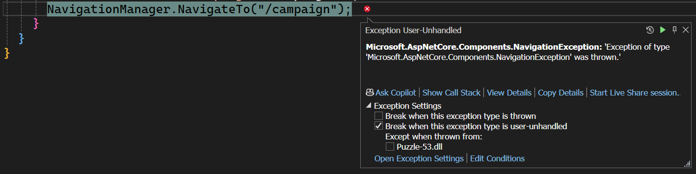

# Puzzle-53 - Navigation Problems

In this week's Blazor Puzzle we're having a problem with navigation from the home page.  This is a Blazor Global Server Interactive application.

The scenario is this: for visitors who come to the home page from a campaign specified by a campaign query string parameter, we want to automatically route them to another page that has additional information about the marketing campaign that they're participating in.
You might see this type of interaction for marketing websites.

Our problem is when a campaign is specified the navigation manager throws an exception.

Can you help us identify why the error is occurring and how to fix it?
