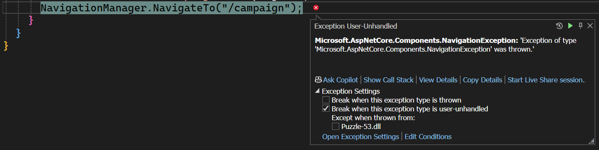
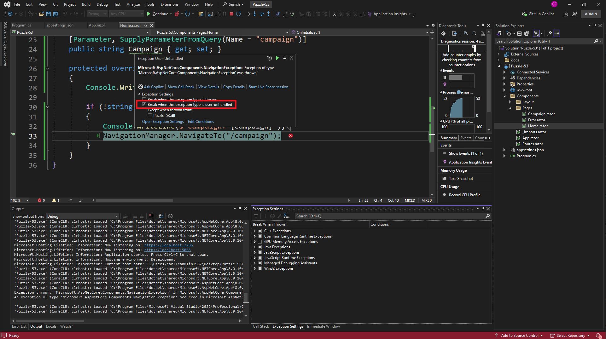

# Blazor Puzzle #53

## Navigation Problems

YouTube Video: https://youtu.be/O00Il7VlJGg

Blazor Puzzle Home Page: https://blazorpuzzle.com

### The Challenge:

In this week's Blazor Puzzle we're having a problem with navigation from the home page.  This is a Blazor Global Server Interactive application.

The scenario is this: for visitors who come to the home page from a campaign specified by a campaign query string parameter, we want to automatically route them to another page that has additional information about the marketing campaign that they're participating in.
You might see this type of interaction for marketing websites.

Our problem is when a campaign is specified the navigation manager throws an exception.



Can you help us identify why the error is occurring and how to fix it?

### The Solution:

This is really a Visual Studio issue. Our winner, Henrik Karlsson, summed it up perfectly:

> It should be better documented, but it seems NavigateTo throws an exception intentionally to be caught by the framework so that the execution of code on the current page breaks. But since the page is not rendered yet when OnInitialized fires, it gets thrown in the current page context. it  This exception can be safely ignored when using the debugger in the exception settings of Visual Studio.

The easiest solution is to uncheck this checkbox right here:



That tells Visual Studio to ignore this error in the future.

However, if you want to fix it with code, you can move the navigation code from `OnInitialized()` to `OnAfterRender()`:

```c#
protected override void OnAfterRender(bool firstRender)
{
    if (firstRender)
    {

        if (!string.IsNullOrEmpty(Campaign))
        {
            Console.WriteLine($"Campaign: {Campaign}");
            NavigationManager.NavigateTo("/campaign");
        }
    }
}

// protected override void OnInitialized()
// {
// 	Console.WriteLine("Home page initialized");

// 	if (!string.IsNullOrEmpty(Campaign))
// 	{
// 		Console.WriteLine($"Campaign: {Campaign}");
// 		NavigationManager.NavigateTo("/campaign");
// 	}
// }
```

Boom!
